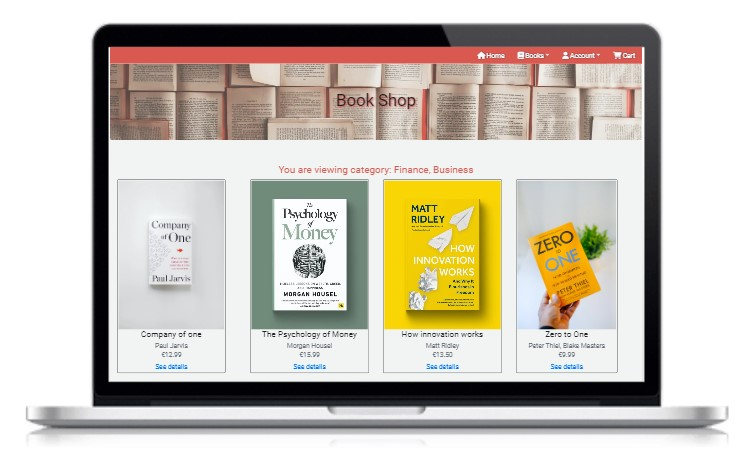

# Table of contents
1. [Welcome](#welcome)
2. [UX Design](#uxdesign)
3. [Features](#features)
    - [Navigation](#navigation)
    - [Accounts](#accounts)
    - [Products](#products)
    - [Reviews](#reviews)
    - [Profile](#profile)
    - [Cart](#cart)
    - [Checkout](#checkout)
4. [Testing](#testing)
    - [Feature testing](#featuretesting)
    - [Validator](#validatortesting)
    - [Responsiveness](#responsivetesting)
    - [Lighthouse](#lighthousetesting)
    - [Other testing](#othertesting)
5. [Technologies](#technologies)
6. [Deployment](#deployment)
7. [Content Credits](#credits)

Live site link: https://ecommerce-store-pp5.herokuapp.com/

## UX Design and project rationale

E-commerce business model

This website is an e-commerce store that sells books. The e-commerce model is B2C, business to customer. Different categories of books are sold on this site and users can browse by a specific category or by all books. 

The site's targeted user is therefore anyone who is interested in reading or in collecting books, and is therefore looking to purchase new books. The site offers a delivery service, at an additional cost, which users are made aware of when viewing their basket and checking out.

The B2C business model that the application is built on allows customers to order goods through the website. These orders are then received by the business and processed according to the information submitted by the customer. Once the order processing is complete, the business supplies the goods to the customer through a delivery service. The customer then receives the items that they ordered, completing the business model cycle. This process is then repeated for each new order that the business receives. This application provides physical books to customers and the value of them books is the price shown on the website.

The purpose of this website is the sale of physical books, which are then delivered to customers who complete the purchase on the website.

User Stories

The User Stories can be found in Github Projects (pp5-ecommerce-store -> Projects -> pp5-eccomerce-store or https://github.com/users/caoimheD/projects/4) and are displayed in the Kanban board format. Each user story has an acceptance criteria and tasks. The User Stories are divided by site role, as different roles can perform different actions:

Site users
- As a site user I can create an account so that I can have a profile and checkout
- As a site user I can browse products so that I can get more information about them
- As a site user I can select a category to view so that I only see relevant products
- As a site user I can select a product I want to buy and add it to cart so that I can purchase it
- As a site user I can edit and remove products from cart so that I only purchase what I need
- As a site user I can checkout from cart so that I can complete the purchase of the items

Registered users
- As a registered user I can login and out of my account so that I can see my profile, keep shopping and leave when I want
- As a registered user I can review products so that I can inform others about my experience
- As a registered user I can view my profile so that I can see my past orders

Admin users
- As an admin user I can create, view, update and delete products so that I can manage the store
- As a site admin I can delete reviews so that old or spam reviews can be removed

Wireframes and design

The design is a simple layout, but with some bright colours to keep the pages interesting. The header image contains pages of books, to keep with the theme of the book shop. The colour palatte was chosen from coolors.co, based on the colours from the header image.

Homepage wireframe

Product page wireframe

Product details page wireframe

SEO and digital marketing

The workspace contains a sitemap.xml and robots.txt file to assist search engines. The robots.txt file disallows any pages with sensitive information.

SEO best practices have been implemented, such as aria-label, rel and alt attributes. Keywords and description have been included in the head of the base template.

On the homepage, there is a newsletter that site users can sign up to to receive updates, discounts and information on new products. This is done with Mailchimp. When a user enters their email, they will be added to the Mailchimp list.

A Facebook page was created for the purposes of digital marketing (please note for the purposes of this project this is a mockup image):

Database structure

There are 7 models used in this website:

| App        | Model  | Relationships | 
| ------------- | ------------- | ------------- | 
| Product  | Category | | 
| Product  | Product | FK: Category | 
| Product  | Review |FK: User, Product | 
| Profiles  | UserProfile | OnetoOne User | 
| Profiles  | Contact | FK: User, Review | 
| Checkout  | Order | FK: UserProfile | 
| Checkout  | OrderLineItem | FK: Order, Product | 

Based on these models and relationships, the django views and templates allow all of the backend and frontend features to be displayed and used. 

## Features

### Navigation bar

The navigation bar is the place where site users can access all of the features of the website. Using the 'books' dropdown arrow, they can select to either view all books or view by category. Using the 'account' dropdown, they can either register for an account, login, or view their profile and logout.

The cart option on the navigation bar allows site users to click into their cart and view what they have added to it. 

This navigation bar is available on all pages of the website, so users are never confused as to how to get back to a certain page or how to login/logout.

### Accounts

If a user is not registered or login, the account dropdown will show them the options 'register' and 'login'. Once user's are logged in, they will see 'my profile' and 'logout' in the account dropdown menu.

The benefits of creating an account and having access to the profile page are:
- This shows users a history of their past orders
- Links they can click to see the full details of the orders
- The option to update their delivery information 
- Ability to leave reviews on products. Once users have an account, they can navigate to any product and click on 'review this book'. There is no approval process for reviews, so these are visible in real time as soon as the user submits the form. 

These benefits are explained on the homepage of the website, so users are aware of the reasons why they would need to create an account.

When signing up, site users will enter in an email address. They receive a confirmation email to this address. Once they verify the email, their account will be active.

### Products

Products can be accessed either by the 'shop now' button on the homepage or through the dropdown menu 'books' on the navigation bar. If accessed through the navigation bar, users will see the option to browse by category or by all books.

For the purposes of this website, stock images have been used as the book images.

On the products page, both for all books and for each category, users see cards with brief information about each book. This information is the title, author, category and price, along with an image. For each book, there is an option to click on 'see details', which brings to the product details page. There is an option on this page to add new products. This is available to admins only and allows them to add new products to the store. This button is not visible to regular site users.

The product details page contains more detailed information about each book, such as a description, ISBN number and reviews. There is an option to add the book to cart, along with a quantity box to specify how many of each product the user wants.

There are two admin buttons on this page, edit and delete. These are accessible to admins only and allow to either update the product or delete it. 

### Reviews

The purpose of this feature is to allow users to leave reviews on products. It is not necessary for the user to have purchased the book to be able to review it. It is however necessary that they are registered with an account.

Users are asked to provide a rating, a title and a comment. They also type in a name, in case they would like to use a different name to the one associated with their profile. The user and book fields are automatically filled in and hidden from the user form.

Once the review is submitted, it appears on the book detail page. Reviews do not get approved so there is no wait time. Users cannot edit or delete their reviews. Currently, only site admins are allowed to delete reviews. The delete button is only visible when logged in as a site admin. Users can request deletion through a form on their profile page, but this needs to be reviewed and actioned by site admins. They do not have the ability to directly delete from the website.

Future features for reviews include restricting the rating numbers so it is not possible to enter any number apart from 1 to 5, and having an average score for each book. There currently is not a high number of reviews on each book to have an average, but this could be developed in the future as the traffic to the site increases.

### Profile

This section of the website is where users can see all of their information, and one of the benefits they receive when signing up for an account. Users can see and update their default delivery information. This is useful if they want to change their default address, or just have this auto-fill with their details when checking out.

Next to the delivery details is a section that contains their previous orders. This is a great way for users to track how many purchases they have made and which books them have bought. When clicking on the order number, this brings them to a page with that order information.

Users can also see their reviews on their profile page. They can see the product they reviewed, the rating, title and review comment. The purpose of this section is that users are able to also keep track of any reviews they have made, without having to search for the book and click into the book details page.

On the profile page, there is a contact button which is specifically for users to request removal of reviews. Please note that this does not automatically remove the review and it is expected behaviour that the review remains on the website after the form is submitted. Only admins can delete reviews directly from the site. The purpose of this contact form is for site users to request removal of a review. That request is then reviewed by site admins and actioned on accordingly. When clicking on the contact button, users will see fields for best contact email (in case they would like to be contacted on a different email to the one used with their account), a dropdown to select the review they want removed, and a message if they want to leave any comments or reasons. Users are only able to see their own reviews in the dropdown, this does not show all reviews of the website. This is not a report option for other site user's reviews, but just a way for users to request their review to be removed if they change their mind at a later date about the comments they made.

### Cart

Users can get to the cart page from the navigation menu by clicking on 'cart'.

If there are no items in the cart, users will see text saying 'Your cart is empty.' and a button to go back to the products page.

Once users have added in an item and then navigate to the cart, they will see an image of the item, the title and author, quantity and price. Users can interact with this page by either updating the quantity (changing the number in the box and then clicking update), or deleting the item from the basket by clicking on the bin icon. The price displayed here is for one of each item, so the price will stay the same regardless of quantity.

Under this box, users see the delivery and total cost information. This will update automatically when the quantity is changed (the 'cart total' heading). There is a fixed delivery cost of 5 EURO per order, this can be seen after the 'delivery' heading. There is then a total, which is the total of the cart plus the delivery fee. Users are also provided with information about free delivery, and how much more they would need to spend to qualify for it.

Clicking on 'secure checkout' will take site users to the checkout page.

### Checkout

The checkout page consists of a form and card payment box, along with a summary of the order that is being placed. If the user is logged out or not registered, there is an option under the form to create an account or sign in to save the information they have put in the form. If the user is logged in, this gives them the option to check a box to save this information to their profile.

If users have previously saved delivery or contact information to their profile, this will display automatically in the form.

The payment box connects to Stripe and processes the card payment. For the purposes of this project, the Stripe test card number was used.

When users have entered in their information and reviewed their order, they can click on complete order which takes them to a success page if the form and payment go through. The checkout success page gives them a summary of the order along with an order number. Details are also sent by email to the email address provided in the form.

## Technologies

- Python

The following python modules were installed and used:

asgiref==3.6.0

backports.zoneinfo==0.2.1

cloudinary==1.32.0

dj-database-url==1.2.0

dj3-cloudinary-storage==0.0.6

Django==3.2.18

django-allauth==0.52.0

django-countries==7.2.1

django-crispy-forms==1.14.0

gunicorn==20.1.0

oauthlib==3.2.2

Pillow==9.4.0

psycopg2==2.9.5

PyJWT==2.6.0

python3-openid==3.2.0

pytz==2022.7.1

requests-oauthlib==1.3.1

sqlparse==0.4.3

stripe==5.3.0

- CSS and Bootstrap
- HTML
- Heroku: The app and website are deployed to Heroku
- ElephantSQL: ElephantSQL was used to create and host the database.
- Fontawesome: icons
- JavaScript
- jQuery
- Django
- Balasmiq
- Google Fonts

## Testing

### Feature testing

Feature testing was done manually by going through each feature and ensuring it works as intended. Below are details of this manual testing:

Homepage

| Action        | Expected Behaviour  | Result | 
| ------------- | ------------- | ------------- | 
| Enter url of site in browser  | site loads media and static files | pass | 
| Click on nav bar links  | each link opens expected page | pass | 
| Click 'register' button  | directs to register page | pass | 
| Click 'shop now' button  | directs to products page | pass | 
| Subscribe to newsletter  | success message, email visible in Mailchimp | pass | 
| Click on the Facebook icon in footer  | directs to Facebook in new tab | pass | 

Additional testing:

Enter random characters in Mailchimp signup form - receive error message as expected

Attempt to login with fake credentials - receive error message as expected

Attempt to register for an account without email/username/password field - receive error message as expected

Products

| Action        | Expected Behaviour  | Result | 
| ------------- | ------------- | ------------- | 
| 'All books' link on nav bar  | displays page with all products | pass | 
| 'Category' link on nav bar  | displays page with only selected category | pass | 
| Browse products page  | cards show book preview with image | pass | 
| Browse products page  | all cards have a 'see more' link to details page | pass | 
| Use the add button (admin only)  | form opens to add a new product | pass | 

Product details

| Action        | Expected Behaviour  | Result | 
| ------------- | ------------- | ------------- | 
| Browse page  | list of book information is displayed | pass | 
| Browse page  | image, title and price are displayed | pass | 
| Browse page  | reviews are visible at the bottom of page | pass | 
| Quantity/add to cart button | adds the specified quantity of item to the cart | pass | 
| Review button  | if logged in, opens form to leave a review | pass | 
| Complete review form  | review is visible on the page | pass | 

Additional testing:

Click on 'review this book' while not logged in/not registered - redirected to login page as expected

Fill in review form but leave fields blank - expected error message is displayed

Shopping cart

| Action        | Expected Behaviour  | Result | 
| ------------- | ------------- | ------------- | 
| Open cart without adding any items  | 'your cart is empty' message | pass | 
| Open cart after adding items  | cart shows items that were added (image, title, author quantity, price) | pass | 
| Open cart after adding items  | cart shows price breakdown (cart total, delivery, final total) | pass | 
| Open cart after adding items (under 30EUR)  | cart shows additional amount needed for free shipping | pass | 
| Change quantity and click 'update'  | cart total price updates | pass | 
| Change quantity and click 'update'  | item quantity updates | pass | 
| Click delete icon | item is removed from cart | pass | 
| Click delete icon  | cart total price updates (if other items in cart) | pass | 
| Click delete icon  | 'your cart is empty' message (if no other items in cart) | pass | 
| Click secure checkout  | directs to checkout page with saved cart info | pass | 

Checkout and payments

| Action        | Expected Behaviour  | Result | 
| ------------- | ------------- | ------------- | 
| Load checkout page  | cart summary shows | pass | 
| Load checkout page  | price summary shows | pass | 
| Load checkout page  | contact and delivery form shows | pass |
| Load checkout page  | stripe card payment box displays | pass |
| Complete form and enter stripe test card number  | redirected to success page | pass |
| Complete form and enter stripe test card number  | event recorded on stripe dashboard | pass | 
| View success page | summary of order and contact/delivery info displayed | pass |

Additional testing:

Complete card payment with Stripe test number 4242 4242 4242 4242 - works as expected

Complete card payment with incorrect card details (e.g. 1111 1111 1111 1111) - error shows

Complete card payment with Stripe test number for declined cards 4000 0000 0000 9995 - error shows as expected

Complete card payment with Stripe test number for authentication required 4000 0025 0000 3155 - auth form displays

Attempt to submit form with missing required fields - error shows stating field is required

Attempt to access /checkout url (without going through website and cart) - 

Stripe dashboard events tracking and webhook details - view transactions made and ensure they are being registered and are successful. Check webhook endpoint in Stripe dashboard and track events - ensure these are showing as succeeded.

User profiles

| Action        | Expected Behaviour  | Result | 
| ------------- | ------------- | ------------- | 
| Use 'my profile' link on nav bar  | profile page displays | pass | 
| Edit the delivery info and click update  | details save and show when returning to page | pass |
| Checkout after filling in info in profile | saved delivery info auto populates | pass |
| View profile page | list of previous orders are displayed | pass |
| Click on order number | page with summary of order is displayed | pass |
| View profile page | user's reviews are displayed | pass |

Additional testing:

Use URL of a user's profile, without being logged in - redirected to login page as expected

Compare different user's profile pages to ensure they display unique information and users are not able to see other user's information.

Reviews

| Action        | Expected Behaviour  | Result | 
| ------------- | ------------- | ------------- | 
| Click 'review this book'  | review form opens | pass | 
| Enter details and submit review  | review shows on product details page | pass | 
| Click 'delete' (admin only)  | asked to confirm deletion, then review is deleted | pass | 
| View profile page after leaving review  | logged in user's reviews show | pass | 
| Click 'contact us' to request removal | form opens and dropdown shows user's reviews | pass |
| Click 'contact us' to request removal | form submits when information is filled in and review selected | pass |

Role-based functionality

| Action        | Expected Behaviour  | Result | 
| ------------- | ------------- | ------------- | 
| Add new book button | visible to superuser only | pass | 
| Edit a book button | visible to superuser only | pass |
| Delete a book button | visible to superuser only | pass |
| Add new book | form works only for superuser | pass | 
| Edit a book | form works only for superuser | pass | 
| Delete a book | form works only for superuser | pass | 

Additional testing for role-based functionality:

Login as regular users and see if admin buttons are visible (confirm they are not visible).

Login as regular user and try URL of admin product forms (add, edit, delete products) in browser and confirm that an error page is displayed.

Login as regular user and try URL of admin review (delete review button) in browser and confirm that an error page is displayed.

Try all admin URLS as a logged out user/non registered user and confirm that an error page is displayed.

Login as superuser and confirm links are visible, try adding, editing, delete products and deleting reviews.

### Validator testing

HTML validator testing was done for each HTML page of the website (https://validator.w3.org/)

On some pages, the validator tool does reference the type="text/javascript" as unnecessary. This was left as is because it is part of the postloadjs block and the type needs to be specified in that block. 

CSS validator testing passed (https://jigsaw.w3.org/css-validator/)

Python testing was done in Gitpod, with errors showing a red underscore and also in the 'problems' tab.

Javascript testing was done by testing the different functionalities, for example the success messages timeout.

### Responsiveness

Bootstrap was used for most of the styling so this ensured that the css was already responsive. This was confirmed through the use of Chrome developer tools and adjusting to different devices. This was also manually done by adjusting the browser window size, without specifiying a particular device type.

### Lighthouse

Lighthouse testing was done through Chrome developer tools. Initially this returned a low score due to the size and dimentions of images. The images were then changed to be a smaller size and this improved the load times are scores.

Result for homepage:

Result for products page (all books):

Result for product details page:

### Other testing

The live website was opened on different browsers and features were used to confirm that they work on different browser or OS types.

Bugs

Currently there are no known bugs on the website.

Fixed bugs: 

500 error on Stripe webhook and emails not sending. This was fixed by correcting the filepath to the confirmation email text file and importing stripe and settings to the webhook file.

400 error Stripe webook. This was fixed by editing the handle_payment_intent_succeeded to get the charge object.

Images and CSS not displaying on Heroku. This was fixed by using the file path of the Cloudinary images directly, and by correcting typing errors for the static file path in settings.py.

Future features:

Review score to contain a max and min score. This is to ensure consistency of review scores. While users are currently informed of how to leave a score (leave a number out of 5 with 5 being the highest), the number box can be changed to enter in a different number. This currently does not have a big impact on the website as admins can remove reviews anyway if they do not comply with guidelines. However this featue would allow for a more streamlined process of leaving reviews.

Cart pop up when adding an item to cart. Currently there is a success message that comes up, so users are notified when they add items to their cart and this is successful. To be in line with industry standards, this can be changed to having the item number show on the ‘cart’ on the nav bar and have a pop up that displays the current cart details.

Search bar. Include a search bar so users can search for books.

## Deployment

This website was deployed through Heroku. Cloudinary was used for static and media files.

A new app was created in Heroku and then linked to the Github repository  (New button -> 'Create new app' -> choose region/name -> Create app). The app was configured in the settings tab and the 'config vars' were set to include database information, along with Cloudinary, email and port details. The database URL points to the database in ElephantSQL. 

Other config vars include the Stripe API keys and webhook key. These ensure that the deployed version of the site has the correct Stripe implementation for payment processing.

Automatic deployments were enabled and a final manual deployment was also done, to ensure all changes on the repository were reflected on the final deployed version.

## References

Bootstrap theme for shopping cart page inspired from: https://mdbootstrap.com/docs/standard/extended/shopping-carts/

Checkout and payments workflow (including webhooks and stripe_elements javascript) is from Code Institute walkthrough project Boutique Ado and from the Stripe documentation (https://stripe.com/docs/payments/quickstart).

Book images are all stock images from stock site unsplash.com, below are the links:

Narnia: https://unsplash.com/photos/xG5VJW-7Bio

How innovation works: https://unsplash.com/photos/H-LIL57PHCc

Psychology of money: https://unsplash.com/photos/aZ_MmSmAcjg

Milk and honey: https://unsplash.com/photos/CXYPfveiuis

Company of one: https://unsplash.com/photos/ViMrMawjj7s

Dorian gray: https://unsplash.com/photos/1i-P178kxHQ

The two towers: https://unsplash.com/photos/O7ygzpAL4Mc

Storytelling workbook: https://unsplash.com/photos/7Nir5-XIRVM

Kinfolk table: https://unsplash.com/photos/tfYL1j1jKNo

101 essays: https://unsplash.com/photos/V5BGaJ0VaLU

Stop worrying: https://unsplash.com/photos/UMlXDGxY6Kc

Sun and her flowers: https://unsplash.com/photos/oKbHnbz2njQ

Heart is the sea: https://unsplash.com/photos/XvMiIGJFKwc

Zero to one: https://unsplash.com/photos/JIWPWcUnhUs

Failed it: https://unsplash.com/photos/RARH8b7N-fw

King of scars: https://unsplash.com/photos/NILnFXRqlr4

Stormbreaker: https://unsplash.com/photos/dBFF-g2MhoE

Lighthouse: https://unsplash.com/photos/7gV36AfCLEM

These images are "Free to use under the Unsplash License" (text from unsplash website).

Workflow for the foundation of the profiles app is from Code Institute Boutique Ado project. Additional features were added to this.

The description of the books in the product details page is from amazon.co.uk
